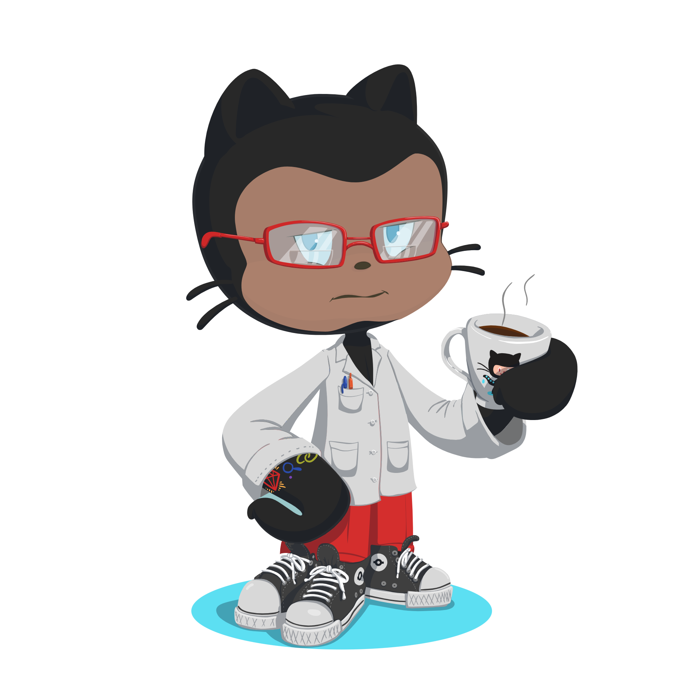

### 👋 Hello! I'm Abdulazeez.


#### A Full-Stack Developer by day ☼ and a Community Contributor by night ☾

## Get in touch ☕

- Your future buddy to discuss Python related things and tech in general on [Twitter](https://x.com/sifusherif).
- Your future life savior on  📚 [Medium](https://medium.com/@sifusherif).
- Your future employee on [LinkedIn](https://www.linkedin.com/in/sifusherif)
- GitHub, well, you're already in the code rabbit hole (Recursion). 🐇.




<!-- ```json
{
    "name": "Abdulazeez",
    "title": "Full Stack Developer",
    "skills": ["HTML", "CSS", "JavaScript", "Python", "Django", "Vuejs", "Nodejs", "Reactjs"],
    "socials": {
        "github": "github.com/thisisazeez",
        "linkedin": "https://www.linkedin.com/in/sifusherif",
        "twitter": "https://www.x.com/sifusherif",
    }
}
``` -->

<!--  -->

<!--
<a href="https://www.buymeacoffee.com/A.A.Sheriff" target="_blank"></a>&nbsp;&nbsp;
<p>Thank you so much for your support. 💖</p>
-->
